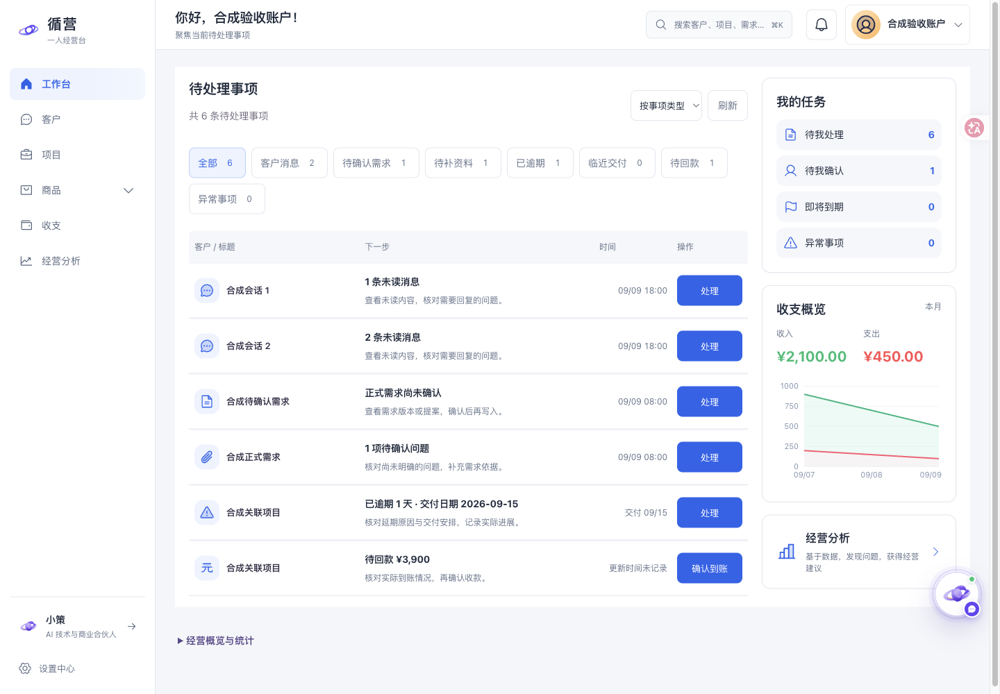
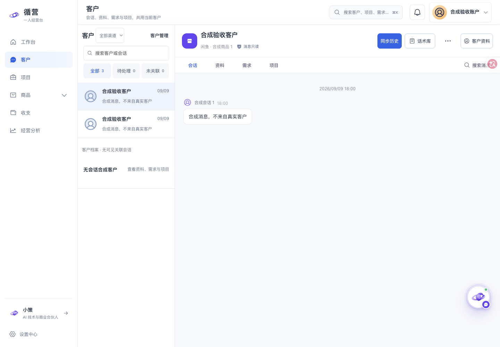
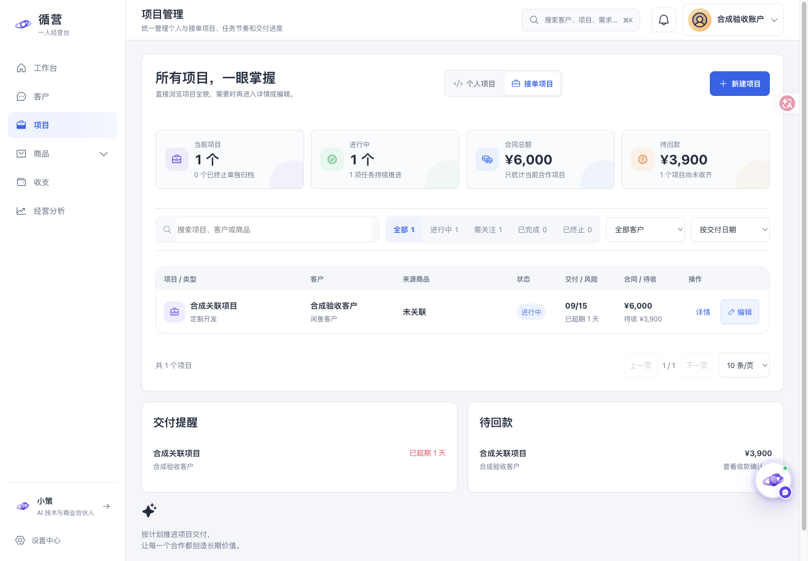
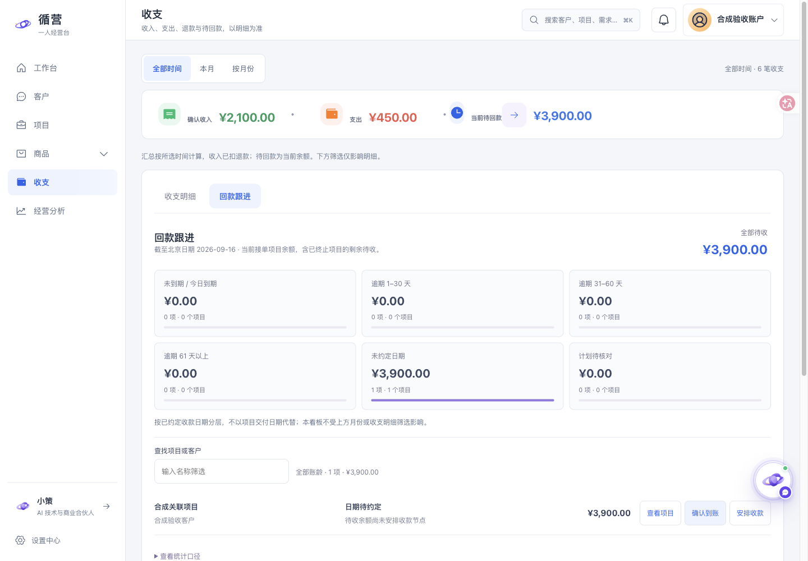

<div align="center">
  
  <h1>循营 · 一人经营台</h1>
  <p><strong>把客户沟通、需求交付与经营账本，串成一条可追溯的工作流。</strong></p>
  <p>面向独立开发者与小型接单业务的本地优先经营工作台</p>
  <p>React 19 · TypeScript · FastAPI · SQLite · MCP</p>
  <p><a href="#界面预览">界面预览</a> · <a href="#快速体验">快速体验</a> · <a href="docs/architecture.md">技术架构</a> · <a href="docs/development.md">开发与验证</a></p>
</div>



> 截图全部使用合成数据，不包含真实客户、聊天记录或经营业绩。当前版本为持续开发中的单机应用，第三方渠道和模型能力需要单独配置。

## 为什么做这个项目

独立开发者的工作往往分散在聊天窗口、需求文档、项目列表和收款记录里：客户说过什么、需求改了几次、项目交付到哪里、还有多少钱没收，容易失去关联。

循营围绕同一个客户和项目组织这些信息，让业务事实可以回查，让 AI 建议有证据，也让重要写入仍由人确认。它适合展示从 React 交互、Python API、关系数据建模到 AI 工具授权的完整工程实践。

## 三分钟阅读路径

1. **看业务闭环**：首页优先展示待处理行动，经营统计按需展开；进入客户工作区查看会话与项目的明确关联。
2. **看工程约束**：阅读 [技术架构](docs/architecture.md)，重点看并发修改、重复请求、会话授权与 AI 草稿边界。
3. **看可验证性**：运行 `pnpm run check`，检查类型、构建、交互回归、收支边界与 Sites 产物；后端另运行 `pnpm run test:backend`。实际结果见 [验证记录](docs/verification.md)。

### 实现取舍与当前不足

这是个人本地经营工具：用 SQLite 与修订号解决单机业务一致性，用显式授权限制 AI 数据访问。没有为展示技术栈引入分布式服务或多租户权限体系。

目前前端入口与部分后端模块仍较大，模块拆分尚未完成；部分交互测试是静态结构检查，不能替代浏览器操作。任务完成不等于客户验收，现已支持按正式需求版本追加操作者录入的验收结论与证据说明，尚不包含客户在线签署。当前没有公开经营效果数据，也不把合成截图当作真实业绩。

## 核心能力

| 场景 | 当前实现 |
| --- | --- |
| 客户与沟通 | 会话、资料、需求、项目集中查看；本地消息搜索、图片归档、明确的客户关联与会话分组 |
| 需求与交付 | 正式需求版本、四层蓝图、变更对比；项目详情按需求、任务、合同回款和附件分区 |
| 收支与经营 | 合同、变更单、收款与支出；历史月份筛选；待回款与历史期间统计分别计算 |
| 商品经营 | 自有商品只读快照、趋势与人工曝光批次记录；访问验证熔断与采集自浏览扣除 |
| AI 合作 | 小策经营分析、显式模型调用；ChatGPT 按会话授权读取，支持 3 / 5 / 7 天有效期；独立的 OpenAI 增量分析订阅 |

## 本次更新

- **工作台 UI 重构**：中性浅色界面、紧凑导航、统一字体与操作控件，适配桌面与手机。
- **接单交付**：项目业务关联图连接客户、需求、任务和收款；开发完成与客户验收独立记录。
- **回款跟进**：按约定收款日期展示账龄，支持未约定日期、异常计划及终止项目余额。
- **工程维护**：工作台聚合查询、模块边界、离线备份与恢复工具，以及前后端持续集成检查。

实现细节见 [UI 设计](docs/ui-design-20260916.md)、[业务关联图](docs/project-relations-20260916.md) 和 [回款设计](docs/erp-reference-upgrade-20260916.md)。

## 界面预览

### 客户工作区

围绕当前客户切换会话、资料、需求与项目。保留消息时间和图片来源，窄屏采用列表进入详情的方式。



### 项目管理

从项目摘要进入需求与交付，区分合同金额、已收款和待回款；任务完成与客户验收保持独立。



### 回款跟进

当前待收与历史收支分开计算，按账龄筛选后可进入原项目核对；所有到账记录仍需人工确认。



## 值得阅读的工程设计

- **业务一致性**：SQLite 是连接本地服务后的权威数据源。修订号检查与请求 ID 防止过期覆盖、重复收款和重复变更；客户关系变更先预览影响，再确认写入。
- **客户上下文隔离**：GPT 通过不透明的 `context_key` 绑定明确选中的会话或成员快照；授权到期、撤销和图片权限分别校验，不通过昵称推断身份。
- **消息与图片有序处理**：原始图片独立归档；按原始消息时间组织文本与图片事件，文本水位与图片修订分别追踪，处理迟到图片和增量读取。
- **AI 与业务写入分离**：增量分析通过事务 Outbox 排队，产物以草稿追加；正式需求转入使用预览、明确确认、版本检查与幂等提交。
- **可验证的交互**：响应式列表/详情、键盘焦点返回、消息滚动定位和历史分页都有独立实现与回归测试；演示夹具阻断真实 API 请求。

源码入口和设计取舍见 [技术架构](docs/architecture.md)。当前亮点、缺口和改进记录见 [项目评审](docs/project-review-20260916.md)。

## 快速体验

### 只看界面：无需数据库、渠道凭证或模型 API

需要 Node.js 22 与 pnpm 10。以下命令使用仓库内的隔离演示夹具：

```bash
git clone https://github.com/ctao2530-cmyk/xianyu-project-ledger-assistant.git
cd xianyu-project-ledger-assistant
pnpm install --frozen-lockfile
pnpm run demo
```

打开 [合成数据演示](http://127.0.0.1:18880/?shell=1&populated=1&reference=1)。演示只监听本机 `18880`，使用内存数据并拒绝业务写入；部分接口故意返回空状态或失败状态，用于交互验收。它不是完整后端演示。

### 运行完整本地应用

另需 Python 3.11+，建议 Python 3.12；以下为 macOS / Linux 命令：

```bash
python3.12 -m venv .venv
.venv/bin/pip install -e '.[dev]'
cp .env.example .env
pnpm run build
pnpm run local
```

打开 **http://127.0.0.1:8877**。启动脚本先执行数据库迁移，再启动 FastAPI；业务数据保存在本地 `data/`。首次运行请使用空目录和空凭证，勿复制其他人的数据库或环境配置。已有服务占用端口时，先确认该服务归属。

前端热更新、测试命令及可选集成见 [开发与验证](docs/development.md)。

当前检查结果与已知测试限制见 [发布验证记录](docs/verification.md)。

## 本地重构进展

工作台已采用分页汇总查询，项目支持有版本与幂等保护的验收记录；新增本机诊断、持续分析日限额与离线恢复工具。细节及验证边界见 [重构记录](docs/refactor-20260916.md)、[备份恢复](docs/local-recovery.md)。这些是当前源码能力，不代表真实客户验收或外部服务已接通。

## 使用边界

本项目以个人本地运行场景为主，不是已完成多租户鉴权的公网 SaaS。不要直接把本地业务 API 暴露到公网。渠道登录、模型凭证和远程 MCP 身份验证需要自行配置；仅启动界面不代表第三方服务已接通。

客户消息页保持只读；真实回复、正式需求转入及关键业务操作保留明确确认。商品分析不会自动编辑商品、上下架或购买流量。短期 GPT 读取授权与持续 OpenAI 分析订阅是两个独立选择。

仓库不提供真实业务数据、凭证或完整生产运行记录。测试与截图展示实现行为，不作为收入效果、模型理解能力或平台稳定性的承诺。

## 项目结构

```text
src/                    React 页面、组件与 API 客户端
backend/app/            FastAPI、业务服务、渠道与 AI 适配器
migrations/versions/    数据库版本迁移
backend/tests/          后端业务与授权测试
tests/                  前端回归与隔离演示夹具
scripts/                本地启动、迁移与构建脚本
docs/                   架构、开发说明与合成截图
```

## 反馈与许可

欢迎通过 Issues 反馈可复现的问题，请使用合成数据并移除凭证、客户消息和个人信息。

仓库目前未附开源许可证；公开源码用于项目展示与技术交流，不代表授予任意再分发或商业使用许可。第三方依赖与素材遵循各自权利及许可要求。
