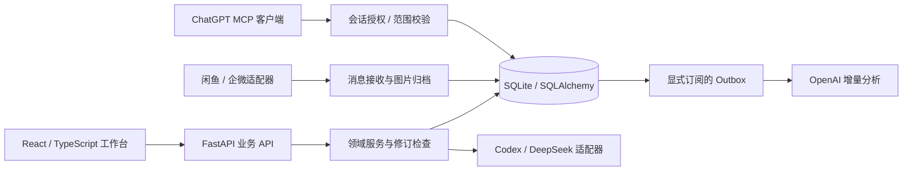

# 技术架构与源码导读

循营采用 React 前端与本地 FastAPI 服务。SQLite 管理业务事实，模型和渠道通过适配层接入。

## 建议阅读顺序

| 关注点 | 源码入口 | 设计问题 |
| --- | --- | --- |
| 前端组织 | [App.tsx](../src/App.tsx)、[workspace](../src/components/workspace/) | 如何让多业务页面共享壳层并保留对象路由？ |
| 业务事实 | [models.py](../backend/app/models.py)、[repository.py](../backend/app/services/repository.py) | 如何避免浏览器旧快照覆盖数据库新版本？ |
| GPT 授权 | [customer_context_gateway.py](../backend/app/services/customer_context_gateway.py)、[customer_context_mcp.py](../backend/app/customer_context_mcp.py) | 如何限定单个客户上下文、处理到期和撤销？ |
| 增量消息 | [customer_context_timeline.py](../backend/app/services/customer_context_timeline.py)、[customer_context_sync.py](../backend/app/services/customer_context_sync.py) | 如何处理分页、水位、重试及迟到图片？ |
| 分析与需求 | [customer_auto_analysis.py](../backend/app/services/customer_auto_analysis.py)、[requirement_proposals.py](../backend/app/services/requirement_proposals.py) | 如何保持模型草稿与正式业务版本隔离？ |

## 关键取舍

**本地优先。** SQLite 简化单人部署并让客户资料留在本机；代价是当前应用不能直接作为公网多租户系统使用。浏览器存储用于旧数据迁移与回退，不替代已连接服务的权威数据。

**身份显式关联。** 客户与渠道身份通过稳定 ID 关联，会话分组冻结授权成员快照。昵称可能重复或变化，因此不用于自动合并身份。

**确认与一致性。** 正式需求使用不可变提案哈希、预期版本和请求 ID 约束写入。金融记录与项目交付状态分别建模，确认收款不会自动完成交付。

**多模态可追溯。** 原始图片保留接收字节，预览衍生物独立存放；事件按消息时间排序，图片更新不依赖文本水位。授权读取到图片内容与模型实际理解内容仍是不同事实。

**AI 权限收敛。** 模型建议需要引用事实来源；持续分析须单独订阅，产物作为草稿追加。授权凭证不应进入日志或仓库，模型失败不静默切换提供商。

## 验证边界

后端测试使用临时数据库、合成身份和模拟提供商；前端夹具禁止真实网络写入。它们覆盖局部业务约束和交互回归，不等于真实账号、网络渠道或模型端到端验收。
